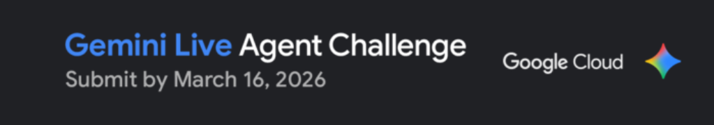

<div align="center">



# VDR Voice Intelligence

**Voice-first M&A due diligence powered by Gemini Live API**

[](https://developers.googleblog.com)
[](https://python.org)
[](https://fastapi.tiangolo.com)
[](https://dash.plotly.com)
[](https://cloud.google.com/run)

*Point it at a Virtual Data Room. Ask your questions out loud. Get spoken answers grounded in the documents.*

</div>

---

## What it does

VDR Voice Intelligence is a voice-first M&A due diligence agent. Upload deal documents or point to a local VDR folder — the app runs a full financial, legal, and compliance analysis using Gemini Flash, then lets you interrogate the deal by voice using the Gemini Live API. Answers are spoken back in real time and transcribed to the conversation panel.

**Built for the [Gemini Live Agent Challenge 2026](https://developers.googleblog.com) · Track: Best Live Agent**

---

## Demo

> 🎥 

---

## Architecture

```
gemini-vdr/
├── backend/
│   ├── main.py                  # FastAPI app — mounts Dash via WSGIMiddleware
│   ├── config.py                # Env vars, PyAudio device detection
│   ├── logger.py                # Coloured terminal logger
│   ├── routers/
│   │   ├── analysis.py          # POST /api/scan, /api/analyse/folder|upload
│   │   └── voice.py             # POST /api/voice/start|stop, GET /api/voice/result
│   └── services/
│       ├── analyser.py          # Gemini Flash document analysis pipeline
│       ├── cache.py             # ChromaDB persistent cache (SHA-256 keyed)
│       ├── extractor.py         # PDF / DOCX / XLSX text extraction
│       └── voice_agent.py       # Gemini Live API session + PyAudio I/O
│
├── frontend/
│   ├── app.py                   # Dash init, layout, WSGI server export
│   ├── styles.py                # Design tokens, CSS vars, theme system
│   ├── components/
│   │   ├── left_panel.py        # VDR input panel (folder path / file upload)
│   │   ├── right_panel.py       # Loading screen + mic button + transcript
│   │   └── results_card.py      # Deal score, risk tags, score bars
│   └── callbacks/
│       ├── analysis_cb.py       # Document scan, analyse, results render
│       ├── voice_cb.py          # Mic toggle, result poller (direct in-process)
│       └── theme_cb.py          # Dark / light theme toggle
│
├── assets/
│   └── banner.png               # ← drop your banner here
├── run.py                       # Single-process launch (FastAPI + Dash)
├── requirements.txt
├── .env.example
└── .gitignore
```

> **Single-process design:** FastAPI and Dash run in the same uvicorn process via `WSGIMiddleware`. This means `voice_state`, `threading.Event`, and the PyAudio stream are all shared memory — no inter-process communication needed.

---

## Stack

| Layer | Tech |
|---|---|
| Voice AI | Gemini Live API (`gemini-2.5-flash-native-audio-preview`) |
| Analysis AI | Gemini Flash (`gemini-2.5-flash`) |
| Backend | FastAPI + Uvicorn |
| Frontend | Plotly Dash + Dash Bootstrap Components |
| Document parsing | PyMuPDF · python-docx · openpyxl |
| Cache | ChromaDB (persistent, SHA-256 keyed) |
| Audio I/O | PyAudio (16kHz input → Gemini, 24kHz output ← Gemini) |
| Cloud | Google Cloud Run |

---

## Setup

### 1. Clone & create venv

```bash
git clone https://github.com/your-username/gemini-vdr.git
cd gemini-vdr

# Windows
py -3.11 -m venv gemini
.\gemini\Scripts\Activate.ps1

# macOS / Linux
python3.11 -m venv gemini
source gemini/bin/activate
```

### 2. Install dependencies

```bash
pip install -r requirements.txt
```

### 3. Configure environment

```bash
cp .env.example .env
```

Open `.env` and add your Gemini API key:

```env
GEMINI_API_KEY=your_key_here
```

Get a free key at [aistudio.google.com](https://aistudio.google.com).

### 4. Run

```bash
python run.py
```

Open **http://localhost:8052**

---

## Usage

1. **Load documents** — paste a VDR folder path or switch to file upload mode and drag in PDFs, DOCX, or XLSX files
2. **Analyse** — click **ANALYSE DOCUMENTS**. Gemini Flash runs financial, legal, and compliance analysis (~15–30s, cached on repeat runs)
3. **Ask by voice** — click the mic button and speak your question
4. **Stop** — click again. Gemini Live processes the audio and plays back a spoken answer
5. **Read the transcript** — the conversation panel shows what you said and what Gemini responded

---

## Cloud Deployment (Google Cloud Run)

```bash
# Build and push
gcloud builds submit --tag gcr.io/YOUR_PROJECT/gemini-vdr

# Deploy
gcloud run deploy gemini-vdr \
  --image gcr.io/YOUR_PROJECT/gemini-vdr \
  --platform managed \
  --region us-central1 \
  --set-env-vars GEMINI_API_KEY=your_key_here \
  --allow-unauthenticated
```

---

## Hackathon

**Gemini Live Agent Challenge 2026** · Track: Best Live Agent ($10K)  
Deadline: March 16, 2026 · 5PM PDT  
Tag: `#GeminiLiveAgentChallenge`

---

<div align="center">
Made with the Gemini Live API · Google Cloud Run · Plotly Dash
</div>
